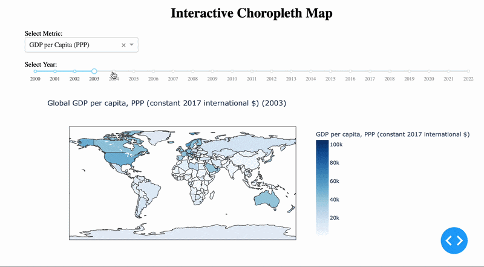

# Visualizing-World-Poverty
CS204 - Data Visualization, 
Chamiande University

This project is an interactive data visualization dashboard that explores global socioeconomic trends using publicly available datasets. The dashboard enables users to analyze changes in GDP per capita, population, and the Global Hunger Index across countries from 2000–2022 through an interactive choropleth map.

## Dashboard Preview

